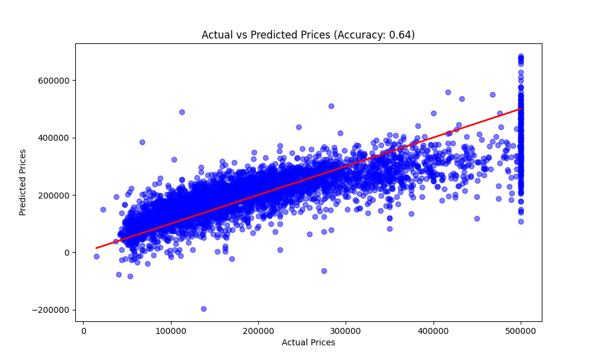

# Housing Price Prediction Model

## Project Overview
This project predicts housing prices based on various features such as location, size, and number of rooms.

## Dataset
I used the **California Housing Prices** dataset, based on data from the 1990 California census.

* **Source:** [California Housing CSV](https://raw.githubusercontent.com/ageron/handson-ml2/master/datasets/housing/housing.csv) (Repository by Aurélien Géron)
* **Description:** The dataset contains 20,640 observations.
* **Key Features used:**
  * `median_income`: Median income in block group (tens of thousands of dollars).
  * `housing_median_age`: Median age of a house within a block.
  * `total_rooms`: Total number of rooms within a block.
  * `total_bedrooms`: Total number of bedrooms within a block.
  * `population`: Total number of people residing within a block.
  * `households`: Total number of households, a group of people residing within a home unit.
  * `median_house_value`: **(Target Variable)** Median house value for households within a block.

## Requirements
* Python 3.x
* Pandas
* Scikit-Learn

## How to Run
1. Clone the repository.
2. Install dependencies.
3. Run the script.

## Results
## Results

### Attempt 1: Simple Linear Regression
I started by using only one feature (Median Income).
* **Model Accuracy:** 46%
* **Insight:** Income alone is not enough to predict housing prices accurately.

### Attempt 2: Multiple Linear Regression (Current Version)
I upgraded the model to use all available features (Income, House Age, Rooms, Population, etc.).
* **Model Accuracy:** ~63% (R² Score: 0.637)
* **Conclusion:** Adding more data dimensions significantly improved the model's predictive power.

